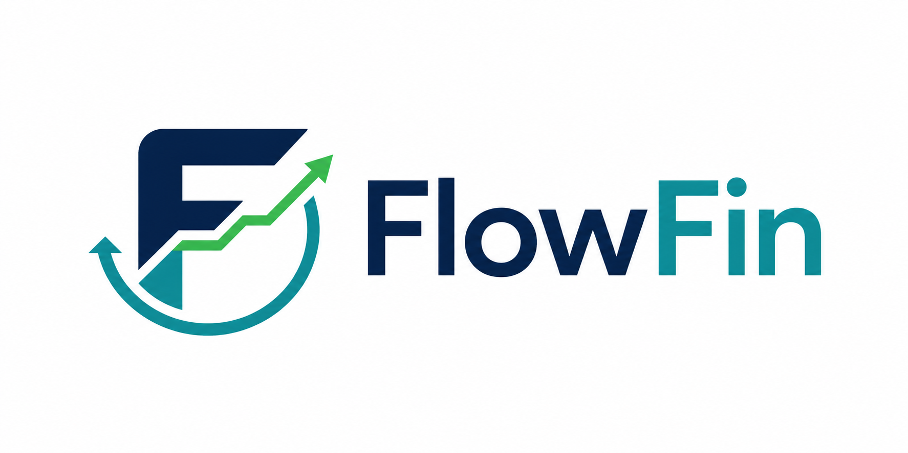
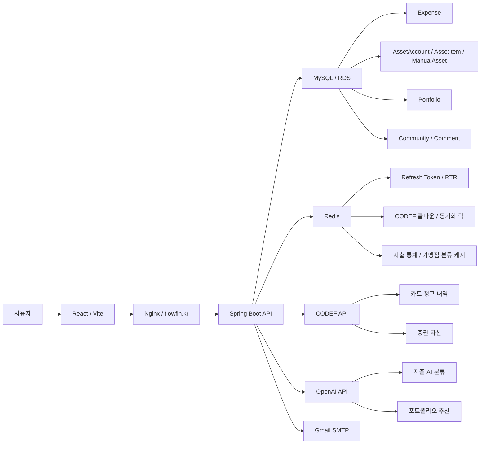
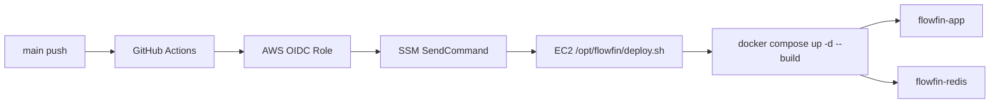
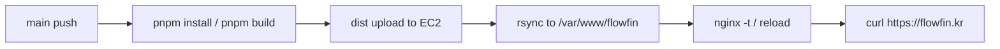

# FlowFin



지출 분석, 자산 통합, AI 진단을 한 흐름으로 연결해 개인의 투자 가능 금액과 포트폴리오 방향을 제안하는 금융 관리 서비스입니다.

[배포 서비스](https://flowfin.kr)


## 프로젝트 소개

FlowFin은 사용자의 카드 지출과 증권 자산을 한곳에 모아 현재 소비 흐름과 투자 여력을 함께 보여주기 위해 만들어졌습니다. 카드 청구 내역은 CODEF를 통해 수집하고, 가맹점 기반 규칙과 OpenAI 분류를 조합해 11개 지출 카테고리로 정리합니다. 증권 자산은 계좌와 보유 종목 단위로 동기화하며, 예수금과 현금성 수동 자산에서 고정비와 비상금을 제외해 투자 가능 금액을 계산합니다.

서비스의 중심은 단순 조회가 아니라 연결된 판단입니다. 흩어진 지출과 자산 데이터를 정리한 뒤, 사용자의 투자 성향과 실제 투자 가능 금액을 바탕으로 AI 포트폴리오 추천을 생성합니다. 민감한 금융 데이터가 오가는 만큼 이메일 해시 조회, AES 기반 양방향 암호화, JWT Refresh Token Rotation, 응답 마스킹을 핵심 전제로 두고 구현했습니다.

## 팀원 구성 & 역할

| 팀원 | 담당 도메인 | GitHub |
| --- | --- | --- |
| A | 회원, 보안, CODEF, AI, DevOps | <!-- TODO: 확인 필요 --> |
| B | API 서버, DB, 커뮤니티 | <!-- TODO: 확인 필요 --> |

## 프로젝트 구조

### Backend

```text
flowfin-server/
├─ .github/
│  └─ workflows/
│     └─ deploy.yml
├─ deploy/
│  └─ nginx/
│     └─ flowfin-server.conf
├─ docker/
│  └─ init.sql
├─ docs/
│  └─ deploy-nginx.md
├─ src/
│  ├─ main/
│  │  ├─ java/com/project/flowfinserver/
│  │  └─ resources/
│  └─ test/
│     ├─ java/com/project/flowfinserver/
│     └─ resources/
├─ build.gradle
├─ docker-compose.prod.yml
└─ Dockerfile
```

```text
src/main/java/com/project/flowfinserver/
├─ cache/
├─ codef/
├─ config/
├─ constant/
├─ controller/
├─ converter/
├─ domain/
├─ dto/
├─ exception/
├─ jwt/
├─ openai/
├─ repository/
├─ service/
└─ util/
```

### Frontend

```text
flowfin-client/
├─ .github/
│  └─ workflows/
│     └─ deploy-frontend.yml
├─ src/
│  ├─ api/
│  ├─ app/
│  │  ├─ components/
│  │  └─ pages/
│  ├─ constants/
│  ├─ styles/
│  └─ types/
└─ package.json
```

## 브랜치 전략 & 컨벤션

운영 배포는 `main` 브랜치를 기준으로 동작합니다. 백엔드와 프론트 GitHub Actions 모두 `main` push를 트리거로 삼고 있으며, 프로젝트 규칙 문서에는 직접 push 대신 PR을 통해 `main`에 반영하는 흐름이 정의되어 있습니다.

| 브랜치 | 용도 |
| --- | --- |
| `main` | 운영 배포 |
| `develop` | 통합 개발 |
| `feature/*` | 기능 개발 |
| `hotfix/*` | 긴급 수정 |

PR 제목과 커밋 성격은 `[add]`, `[fix]`, `[refactor]`, `[test]`, `[docs]`, `[chore]` 태그를 사용합니다.

## 기술 스택

### Backend


### Frontend


### Infra


### External


## 시스템 아키텍처



## 주요 기능 + 데모

### 회원가입, 로그인, 토큰 재발급

이메일 인증 후 회원가입하고, 로그인 시 Access Token과 Refresh Token을 발급합니다. Access Token은 응답으로 내려가고 Refresh Token은 HttpOnly 쿠키로 관리되며, 서버는 Redis에 사용자별 Refresh Token을 저장합니다. 토큰 재발급 시 기존 Refresh Token과 Redis 저장값을 비교하고, 일치하지 않으면 저장 토큰을 삭제해 재사용을 차단합니다.


<!-- TODO: 확인 필요 -->

### CODEF 카드/증권 연동

카드와 증권 계정을 CODEF `createAccount` 흐름으로 연결하고, 연결 직후 초기 동기화를 비동기로 시작합니다. 카드 동기화는 청구 내역을 Expense로 저장하고, 증권 동기화는 계좌와 보유 종목을 AssetAccount와 AssetItem으로 upsert합니다. 수동 동기화는 Redis 쿨다운으로 5분에 한 번만 허용됩니다.


<!-- TODO: 확인 필요 -->

### 지출 조회와 자동 분류

카드 청구 내역은 가맹점명 기반 Rule 분류를 먼저 시도합니다. Rule이 없으면 `PENDING` 상태로 저장한 뒤 트랜잭션 커밋 후 OpenAI 분류를 비동기로 수행합니다. 분류 결과는 11개 고정 카테고리 중 하나로 저장하고, 신뢰도가 기준값보다 낮거나 파싱에 실패하면 기타지출로 fallback합니다. 사용자가 직접 수정한 지출은 자동 분류가 덮어쓰지 않습니다.


<!-- TODO: 확인 필요 -->

### 자산 통합과 투자 가능 금액 계산

증권 계좌의 예수금과 수동 입력한 현금성 자산을 합산하고, 최근 고정비 평균과 비상금을 제외해 투자 가능 금액을 계산합니다. 계산 결과가 음수면 0으로 보정하며, 자산이 연결되지 않은 경우 포트폴리오 추천 전에 자산 연결이 필요하다는 응답을 반환합니다.


<!-- TODO: 확인 필요 -->

### AI 포트폴리오 추천

투자 성향과 투자 가능 금액을 기반으로 OpenAI 포트폴리오 추천을 생성합니다. 응답은 자산군, 하위 분류, 비중, 금액, 추천 사유로 정규화되며, 비중 합계 검증과 특정 상품명 제거 처리를 거쳐 Portfolio에 저장됩니다.


<!-- TODO: 확인 필요 -->

### 커뮤니티와 댓글

게시글 목록, 상세 조회, 작성, 수정, 삭제, 좋아요, 포트폴리오 공유를 제공합니다. 댓글은 커뮤니티 게시글 하위 리소스로 관리되며, 프로젝트 규칙상 하드 삭제 대신 삭제 상태를 응답에서 처리하는 흐름을 사용합니다.


<!-- TODO: 확인 필요 -->

## 핵심 기술

### CODEF 에러 처리

문제는 외부 금융기관 오류가 모두 같은 실패가 아니라는 점이었습니다. 인증 정보 오류, 일시 장애, 기관 점검, 중복 로그인, 조회 결과 없음, 상품 미지원은 사용자에게 보여줄 메시지도 다르고 서버가 취해야 할 행동도 다릅니다.

원인은 CODEF 응답 코드가 API 호출 지점마다 섞여 들어오고, 단순 예외 처리로는 재시도해야 할 오류와 즉시 중단해야 할 오류를 구분하기 어렵다는 데 있었습니다.

해결은 `CodefErrorClassifier`에서 CODEF 코드를 `AUTH_ERROR`, `TRANSIENT_ERROR`, `COOLDOWN`, `INSTITUTION_UNAVAILABLE`, `UNSUPPORTED_OPERATION`, `EMPTY_RESULT` 같은 타입으로 나누는 방식으로 구현했습니다. `CodefSyncService`는 이 분류에 따라 일시 오류는 제한적으로 재시도하고, 기관 점검은 해당 회차를 건너뛰며, 쿨다운과 중복 로그인은 즉시 재호출을 막습니다. 매일 새벽 2시 배치는 활성 연결만 순회하고, 재시도 후에도 실패한 연결은 비활성화합니다.

### JWT Refresh Token Rotation

문제는 Refresh Token이 탈취되었을 때 기존 토큰이 계속 살아 있으면 Access Token을 반복 재발급할 수 있다는 점이었습니다.

원인은 Refresh Token을 stateless하게만 검증하면 서버가 "현재 유효한 최신 토큰"을 판별하기 어렵다는 데 있었습니다.

해결은 Redis에 `refresh:token:{userId}` 형태로 Refresh Token을 저장하고, 재발급 요청 시 쿠키의 토큰과 Redis 저장값을 비교하는 방식입니다. 값이 일치하지 않으면 Redis 토큰을 삭제해 재사용을 차단하고, 정상 요청이면 기존 토큰을 삭제한 뒤 새 Access Token과 Refresh Token을 발급합니다.

### AES-256 암호화와 마스킹

문제는 connectedId, 계좌번호, 카드번호처럼 다시 사용해야 하는 금융 식별자는 단방향 해시만으로 처리할 수 없지만, 평문 저장도 허용할 수 없다는 점이었습니다.

원인은 CODEF 재조회와 자산 조회에서는 원문 값이 필요하고, 동시에 DB 유출 시 원문이 노출되면 안 되기 때문입니다.

해결은 `AesEncryptConverter`를 JPA Converter로 적용해 엔티티 저장 시 AES/CBC/PKCS5Padding으로 암호화하고 조회 시 복호화하도록 만들었습니다. 응답 DTO에서는 `MaskingUtil`을 통해 카드번호, 계좌번호, 이메일, connectedId를 마스킹합니다. 랜덤 IV를 사용하는 암호문은 같은 평문도 매번 달라질 수 있으므로, 직접 조회가 필요한 이메일은 SHA-256 해시를 별도 저장하고, 자산 계좌는 사용자와 기관 코드 조합으로 조회합니다.

### Rule + OpenAI 지출 분류

문제는 카드 가맹점명이 정형화되어 있지 않아 모든 지출을 규칙만으로 안정적으로 분류하기 어렵다는 점이었습니다.

원인은 같은 카테고리라도 가맹점명 표현이 다양하고, OpenAI 호출을 동기 트랜잭션 안에서 수행하면 DB 커넥션 점유와 장애 전파가 커진다는 데 있었습니다.

해결은 먼저 `ExpenseKeywordClassifier`와 `ExpenseClassificationService`로 규칙 분류를 수행하고, 실패한 지출만 `PENDING`으로 저장한 뒤 커밋 이후 `AiExpenseClassifier`가 비동기 분류하도록 나눈 것입니다. 가맹점명 해시 기반 Redis 캐시를 7일 유지해 반복 호출을 줄이고, OpenAI 응답 신뢰도가 기준값보다 낮으면 기타지출로 보정합니다.

### 증권 자산 동기화 안전장치

문제는 CODEF 증권 응답이 불완전할 때 기존 보유 종목을 잘못 삭제할 수 있다는 점이었습니다.

원인은 보유 종목 리스트 일부가 실패했거나 종목 코드가 비어 있는데도 전체 응답을 정상 목록으로 간주하면, 실제 보유 중인 종목을 매도 완료로 오판할 수 있기 때문입니다.

해결은 응답의 `resItemList`가 유효하고 스킵된 항목이 없을 때만 reconcile 삭제를 수행하는 것입니다. 응답이 불완전하지만 정상 종목 일부가 있으면 기존 계좌 금액 갱신과 삭제는 피하고, 정상 종목만 upsert합니다. 전량 매도 종목은 수량, 매입금액, 평가금액이 모두 0인 경우에만 보유 목록에서 제외합니다.

## CI/CD 파이프라인

### Backend

백엔드 배포는 `.github/workflows/deploy.yml`에서 `main` 브랜치 push를 기준으로 실행됩니다. GitHub Actions는 `aws-actions/configure-aws-credentials@v4`를 사용해 OIDC 방식으로 AWS Role을 Assume하고, `aws ssm send-command`로 EC2 인스턴스에 `AWS-RunShellScript` 명령을 보냅니다. 실제 서버에서는 `/opt/flowfin/deploy.sh`가 실행되며, 워크플로는 SSM Command 상태를 최대 1200초 동안 확인한 뒤 성공 여부에 따라 로그를 출력하고 실패 시 job을 중단합니다.

컨테이너 실행 구조는 `docker-compose.prod.yml`에 정의되어 있습니다. Spring Boot 애플리케이션은 `flowfin-app` 컨테이너로 8080 포트를 로컬 바인딩하고, Redis는 `redis:7.2-alpine` 이미지를 사용합니다. 운영 환경변수는 `/etc/flowfin/prod.env`에서 주입되며, 민감값은 README에 기록하지 않습니다.



### Frontend

프론트 배포는 `flowfin-client/.github/workflows/deploy-frontend.yml`에서 확인됩니다. `main` 브랜치 push 후 pnpm 10과 Node.js 20을 설치하고, `pnpm install --frozen-lockfile`로 의존성을 고정 설치한 뒤 `pnpm build`를 실행합니다. 빌드 결과물은 `appleboy/scp-action`으로 EC2에 업로드되고, SSH 단계에서 `/var/www/flowfin`으로 동기화한 뒤 Nginx 설정 검증과 reload를 수행합니다.


