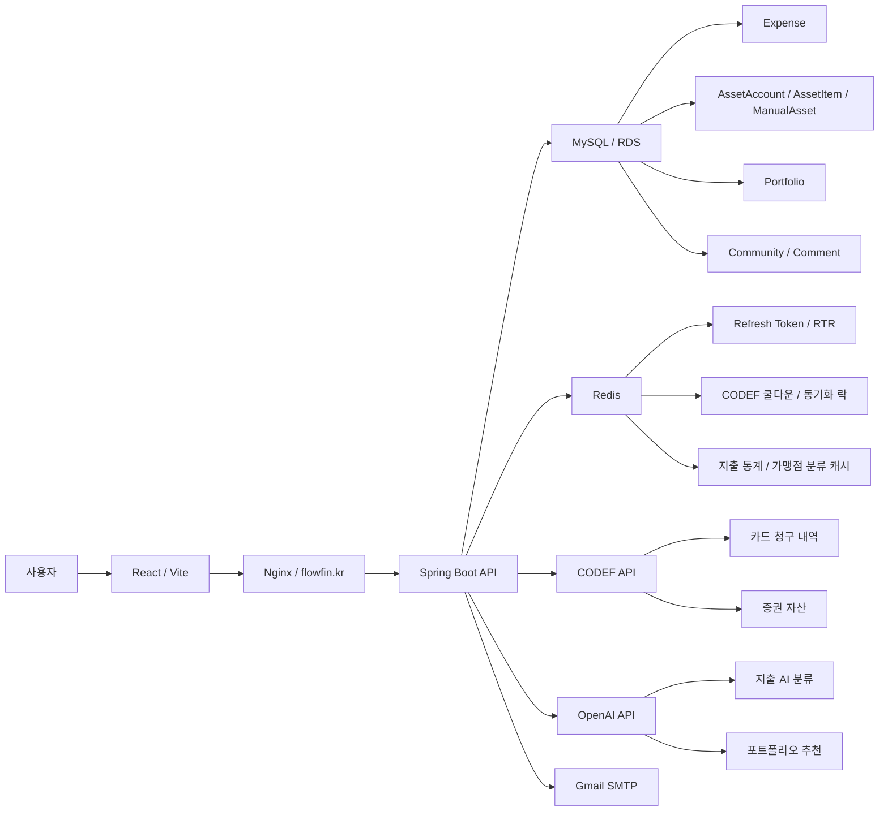
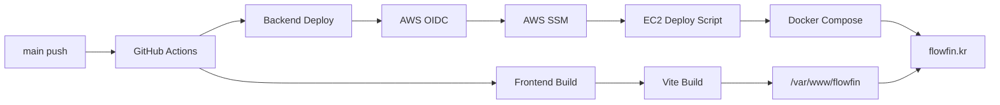

# FlowFin


지출 분석, 자산 통합, AI 진단을 한 흐름으로 연결해 개인의 투자 가능 금액과 포트폴리오 방향을 제안하는 금융 관리 서비스입니다.

[배포 서비스](https://flowfin.kr)


## 프로젝트 소개

FlowFin은 사용자의 카드 지출과 증권 자산을 한곳에 모아 현재 소비 흐름과 투자 여력을 함께 보여주기 위해 만들어졌습니다. 카드 청구 내역은 CODEF를 통해 수집하고, 가맹점 기반 규칙과 OpenAI 분류를 조합해 11개 지출 카테고리로 정리합니다. 증권 자산은 계좌와 보유 종목 단위로 동기화하며, 예수금과 현금성 수동 자산에서 고정비와 비상금을 제외해 투자 가능 금액을 계산합니다.

서비스의 중심은 단순 조회가 아니라 연결된 판단입니다. 흩어진 지출과 자산 데이터를 정리한 뒤, 사용자의 투자 성향과 실제 투자 가능 금액을 바탕으로 AI 포트폴리오 추천을 생성합니다. 민감한 금융 데이터가 오가는 만큼 이메일 해시 조회, AES 기반 양방향 암호화, JWT Refresh Token Rotation, 응답 마스킹을 핵심 전제로 두고 구현했습니다.

## 팀원 구성 & 역할

<table>
  <tr>
    <th align="center">구분</th>
    <th align="center">오경택</th>
    <th align="center">김진엽</th>
  </tr>
  <tr>
    <td align="center">프로필</td>
    <td align="center">
      
    </td>
    <td align="center">
      
    </td>
  </tr>
  <tr>
    <td align="center">담당 도메인</td>
    <td align="center">API 서버, DB, 보안, CODEF, AI, DevOps</td>
    <td align="center">회원, 커뮤니티</td>
  </tr>
  <tr>
    <td align="center">GitHub</td>
    <td align="center"><a href="https://github.com/ogt-git">@ogt-git</a></td>
    <td align="center"><a href="https://github.com/jinyeob1101">@jinyeob1101</a></td>
  </tr>
</table>

## 프로젝트 구조

### Backend

```text
flowfin-server/
├─ .github/
│  └─ workflows/
│     └─ deploy.yml
├─ deploy/
│  └─ nginx/
│     └─ flowfin-server.conf
├─ docker/
│  └─ init.sql
├─ docs/
│  └─ deploy-nginx.md
├─ src/
│  ├─ main/
│  │  ├─ java/com/project/flowfinserver/
│  │  └─ resources/
│  └─ test/
│     ├─ java/com/project/flowfinserver/
│     └─ resources/
├─ build.gradle
├─ docker-compose.prod.yml
└─ Dockerfile
```

```text
src/main/java/com/project/flowfinserver/
├─ cache/
├─ codef/
├─ config/
├─ constant/
├─ controller/
├─ converter/
├─ domain/
├─ dto/
├─ exception/
├─ jwt/
├─ openai/
├─ repository/
├─ service/
└─ util/
```

## 브랜치 전략 & 컨벤션

운영 배포는 `main` 브랜치를 기준으로 동작합니다. 백엔드와 프론트 GitHub Actions 모두 `main` push를 트리거로 삼고 있으며, 프로젝트 규칙 문서에는 직접 push 대신 PR을 통해 `main`에 반영하는 흐름이 정의되어 있습니다.

| 브랜치 | 용도 |
| --- | --- |
| `main` | 운영 배포 |
| `develop` | 통합 개발 |
| `feature/*` | 기능 개발 |
| `hotfix/*` | 긴급 수정 |

PR 제목과 커밋 성격은 `[add]`, `[fix]`, `[refactor]`, `[test]`, `[docs]`, `[chore]` 태그를 사용합니다.

## 기술 스택

### Backend


### Frontend


### Infra


### External


## 시스템 아키텍처



## 주요 기능 + 데모

### 회원가입, 로그인, 토큰 재발급

이메일 인증 후 회원가입하고, 로그인 시 Access Token과 Refresh Token을 발급합니다. Access Token은 응답으로 내려가고 Refresh Token은 HttpOnly 쿠키로 관리되며, 서버는 Redis에 사용자별 Refresh Token을 저장합니다. 토큰 재발급 시 기존 Refresh Token과 Redis 저장값을 비교하고, 일치하지 않으면 저장 토큰을 삭제해 재사용을 차단합니다.


<!-- TODO: 확인 필요 -->

### CODEF 카드/증권 연동

카드와 증권 계정을 CODEF `createAccount` 흐름으로 연결하고, 연결 직후 초기 동기화를 비동기로 시작합니다. 카드 동기화는 청구 내역을 Expense로 저장하고, 증권 동기화는 계좌와 보유 종목을 AssetAccount와 AssetItem으로 upsert합니다. 수동 동기화는 Redis 쿨다운으로 5분에 한 번만 허용됩니다.


<!-- TODO: 확인 필요 -->

### 지출 조회와 자동 분류

카드 청구 내역은 가맹점명 기반 Rule 분류를 먼저 시도합니다. Rule이 없으면 `PENDING` 상태로 저장한 뒤 트랜잭션 커밋 후 OpenAI 분류를 비동기로 수행합니다. 분류 결과는 11개 고정 카테고리 중 하나로 저장하고, 신뢰도가 기준값보다 낮거나 파싱에 실패하면 기타지출로 fallback합니다. 사용자가 직접 수정한 지출은 자동 분류가 덮어쓰지 않습니다.


<!-- TODO: 확인 필요 -->

### 자산 통합과 투자 가능 금액 계산

증권 계좌의 예수금과 수동 입력한 현금성 자산을 합산하고, 최근 고정비 평균과 비상금을 제외해 투자 가능 금액을 계산합니다. 계산 결과가 음수면 0으로 보정하며, 자산이 연결되지 않은 경우 포트폴리오 추천 전에 자산 연결이 필요하다는 응답을 반환합니다.


<!-- TODO: 확인 필요 -->

### AI 포트폴리오 추천

투자 성향과 투자 가능 금액을 기반으로 OpenAI 포트폴리오 추천을 생성합니다. 응답은 자산군, 하위 분류, 비중, 금액, 추천 사유로 정규화되며, 비중 합계 검증과 특정 상품명 제거 처리를 거쳐 Portfolio에 저장됩니다.


<!-- TODO: 확인 필요 -->

### 커뮤니티와 댓글

게시글 목록, 상세 조회, 작성, 수정, 삭제, 좋아요, 포트폴리오 공유를 제공합니다. 댓글은 커뮤니티 게시글 하위 리소스로 관리되며, 프로젝트 규칙상 하드 삭제 대신 삭제 상태를 응답에서 처리하는 흐름을 사용합니다.


<!-- TODO: 확인 필요 -->

## 핵심 기술

- CODEF 오류를 인증 실패, 일시 장애, 기관 점검, 쿨다운, 미지원 기능 등으로 분류해 재시도와 사용자 안내 흐름을 분리했습니다.
- JWT Refresh Token Rotation을 적용해 Redis에 저장된 최신 Refresh Token만 재발급에 사용할 수 있도록 했습니다.
- 이메일 해시 조회, AES-256 암호화, 응답 마스킹을 통해 금융 식별자와 개인정보 노출을 줄였습니다.

## CI/CD 파이프라인

백엔드와 프론트 모두 `main` 브랜치 push를 기준으로 배포됩니다. 백엔드는 GitHub Actions에서 AWS OIDC 인증 후 SSM으로 EC2 배포 스크립트를 실행하고, 프론트는 Vite 빌드 결과물을 EC2의 Nginx 정적 파일 경로로 배포한 뒤 `flowfin.kr` 응답을 확인합니다.


